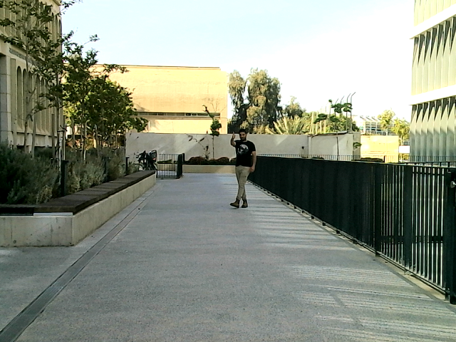
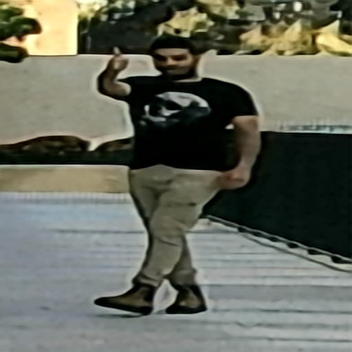

# Ultra-Range Gesture Recognition 

---

Hand gestures play a crucial role in human interactions and serve as an efficient means of 
communication in **Human-Robot Interaction (HRI)**. This repository presents the **Ultra-Range Gesture 
Recognition (URGR) framework**, designed to recognize gestures from distances of up to **25 meters** 
using a deep-learning model and a simple RGB camera. 

📹 **Watch the demo:** 


<p align="center">
  <a href="https://youtu.be/dw8BTe6PuDc?si=tIfFZgjCZKYmSi2Q">
    
  </a>
</p>

This repository is based on our paper:  
📄 **Ultra-Range Gesture Recognition using a Web-Camera in Human-Robot Interaction** (2024).  
[🔗 Read the full article](https://www.sciencedirect.com/science/article/pii/S0952197624006018)

---

## 🚀 Quick Start  
This project demonstrates **Ultra-Range Gesture Recognition (URGR)**, detecting gestures up to **25 meters** away using deep learning.

### **How to Run the Model**
To test the model, please **contact me** to obtain the necessary checkpoints.
Once you have the checkpoints, run the following command:

```sh
python New_RealTime_Class.py
```

---

## ✨ Pipeline Overview
Our framework processes gestures in three key steps:

🔹 **User Detection & Cropping:**  
   - The user is detected using **YOLOv3**, and the background is removed to focus on the gesture.

🔹 **Super-Resolution Enhancement:**  
   - Due to the long distance, the user's image is low-quality.  
   - We apply **HQNet**, a super-resolution model, to enhance the cropped image.

🔹 **Gesture Classification:**  
   - A classification model predicts the user's gesture.


<p align="center">
  
  
  
</p>

<p align="center">
  <b>Original Image</b> | <b>After YOLOv3 Cropping</b> | <b>After HQNet Super-Resolution</b>
</p>

---

## 📊 Results & Performance

The URGR framework achieves:

✅ **98.1% recognition accuracy** on diverse test data  
✅ **96% recognition accuracy** in real-world tests with an autonomous quadruped robot  

### **Benchmarking Against Other Models**
| Model            | Accuracy | 
|------------------|----------|
| DenseNet         | 92.1%    | 
| EfficientNet     | 87.5%    | 
| GoogLeNet        | 84.1%    | 
| WideResNet       | 89.8%    | 
| GViT (our model) | **98.1** | 

The model outperforms traditional gesture recognition methods, even at ultra-range distances.

---

## 🔥 My Contribution
- **Developed the HQ-Hourglass model** to enhance low-resolution images, improving gesture classification at long distances.
- **Designed the full gesture classification pipeline**, integrating YOLOv3 for person detection and HQNet for super-resolution.
- **Improved accuracy to 98.1%**, outperforming human recognition in ultra-range conditions.
- Conducted extensive **testing on quadruped robots** in challenging environments, achieving a **96%** real-world accuracy.

---

## 📜 Citation
⚠️ **Disclaimer**  
This repository is **not the official implementation** of our paper  
["Ultra-Range Gesture Recognition using a Web-Camera in Human-Robot Interaction"](https://www.sciencedirect.com/science/article/pii/S0952197624006018).  
Instead, this repository includes **a different version** used for **training and benchmarking 
purposes** to compare against the model described in the paper.  

At this time, there is no publicly available repository for the official implementation.  

If you use this work, please cite:

**Eran Bamani and Eden Nissinman**, *Ultra-Range Gesture Recognition using a Web-Camera in Human-Robot Interaction*, **Engineering Applications of Artificial Intelligence**, 2024.  
🔗 [Read the full paper](https://www.sciencedirect.com/science/article/pii/S0952197624006018)


### **BibTeX:**
```bibtex
@article{BAMANI2024108443,
  title = {Ultra-Range Gesture Recognition using a web-camera in Human–Robot Interaction},
  journal = {Engineering Applications of Artificial Intelligence},
  year = {2024},
  doi = {https://doi.org/10.1016/j.engappai.2024.108443},
  author = {Eran Bamani and Eden Nissinman and Inbar Meir and Lisa Koenigsberg and Avishai Sintov},
}
```

