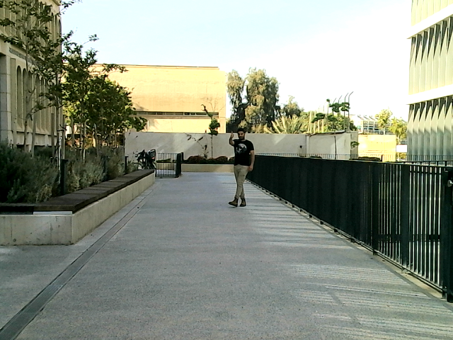
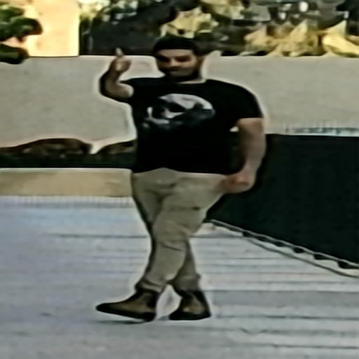

# Ultra-Range Gesture Recognition 

---

Hand gestures play a crucial role in human interactions and serve as an efficient means of 
communication in **Human-Robot Interaction (HRI)**. This repository presents the **Ultra-Range Gesture 
Recognition (URGR) framework**, designed to recognize gestures from distances of up to **25 meters** 
using a deep-learning model and a simple RGB camera. 

📹 **Watch the demo:** 


<p align="center">
  <a href="https://youtu.be/dw8BTe6PuDc?si=tIfFZgjCZKYmSi2Q">
    
  </a>
</p>

This repository is based on our paper:  
📄 **Ultra-Range Gesture Recognition using a Web-Camera in Human-Robot Interaction** (2024).  
[🔗 Read the full article](https://www.sciencedirect.com/science/article/pii/S0952197624006018)


---

## ✨ Pipeline Overview
Our framework processes gestures in three key steps:

🔹 **User Detection & Cropping:**  
   - The user is detected using **YOLOv3**, and the background is removed to focus on the gesture.

🔹 **Super-Resolution Enhancement:**  
   - Due to the long distance, the user's image is low-quality.  
   - We apply **HQ-Hourglass**, a super-resolution model, to enhance the cropped image.

🔹 **Gesture Classification:**  
   - A classification model predicts the user's gesture.  
   - This repository includes a **DenseNet** classifier and other well-known models.


[//]: # (As a part of our work to comparing models, this repository demonstrates an employment of a simple HQ model)

[//]: # (names HQ-Hourglass, to improve the image quality of a long distance images, and a DenseNet model to predict )

[//]: # (the gesture of the user. More well-known classification models were used in order )

[//]: # (to benchmark our prime model from the paper.)

<p align="center">
  
  
  
</p>

<p align="center">
  <b>Original Image</b> | <b>After YOLOv3 Cropping</b> | <b>After HQ-Hourglass Super-Resolution</b>
</p>


## 📜 Citation
If you use this work, please cite:

**Eran Bamani and Eden Nissinman**, *Ultra-Range Gesture Recognition using a Web-Camera in Human-Robot Interaction*, **Engineering Applications of Artificial Intelligence**, 2024.  
🔗 [Read the full paper](https://www.sciencedirect.com/science/article/pii/S0952197624006018)

### **BibTeX:**
```bibtex
@article{BAMANI2024108443,
  title = {Ultra-Range Gesture Recognition using a web-camera in Human–Robot Interaction},
  journal = {Engineering Applications of Artificial Intelligence},
  year = {2024},
  doi = {https://doi.org/10.1016/j.engappai.2024.108443},
  author = {Eran Bamani and Eden Nissinman and Inbar Meir and Lisa Koenigsberg and Avishai Sintov},
}